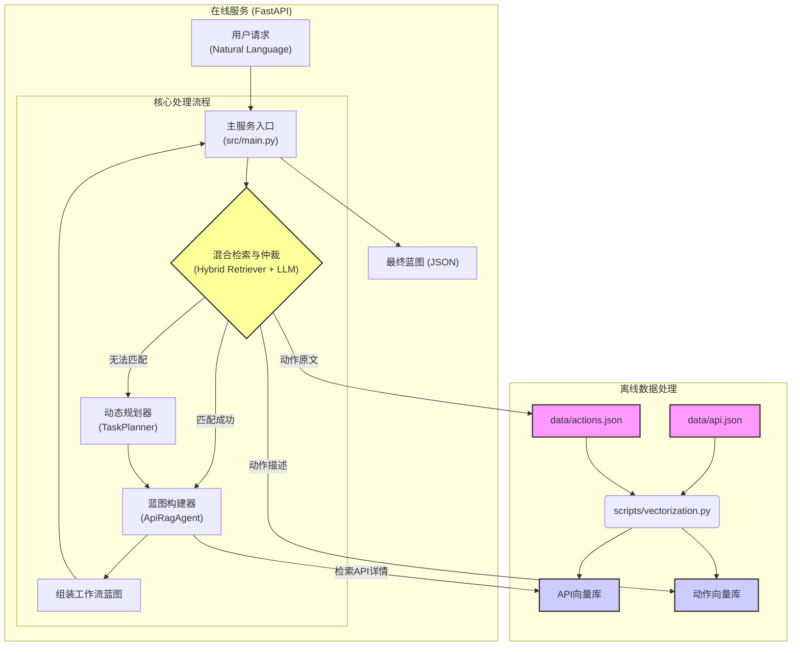

```mermaid
graph TD
    subgraph "离线数据处理"
        direction TB
        A1["data/api.json"] --> SCRIPT("scripts/vectorization.py");
        A2["data/actions.json"] --> SCRIPT;
        SCRIPT --> VS_API["API向量库"];
        SCRIPT --> VS_ACTION["动作向量库"];
    end

    subgraph "在线服务 (FastAPI)"
        direction LR
        USER["用户请求\n(Natural Language)"] --> MAIN["主服务入口\n(src/main.py)"];
        
        subgraph "核心处理流程"
            direction TB
            MAIN --> RETRIEVER{"混合检索与仲裁\n(Hybrid Retriever + LLM)"};
            RETRIEVER -- "动作描述" --> VS_ACTION;
            RETRIEVER -- "动作原文" --> A2;
            
            RETRIEVER -- "匹配成功" --> PLAN_BUILDER["蓝图构建器\n(ApiRagAgent)"];
            RETRIEVER -- "无法匹配" --> PLANNER["动态规划器\n(TaskPlanner)"];
            
            PLANNER --> PLAN_BUILDER;
            
            PLAN_BUILDER -- "检索API详情" --> VS_API;
            PLAN_BUILDER --> FINAL_PLAN["组装工作流蓝图"];
        end

        FINAL_PLAN --> MAIN;
        MAIN --> RESPONSE["最终蓝图 (JSON)"];
    end

    style A1 fill:#f9f,stroke:#333,stroke-width:2px
    style A2 fill:#f9f,stroke:#333,stroke-width:2px
    style VS_API fill:#ccf,stroke:#333,stroke-width:2px
    style VS_ACTION fill:#ccf,stroke:#333,stroke-width:2px
    style RETRIEVER fill:#ff9,stroke:#333,stroke-width:2px
```
