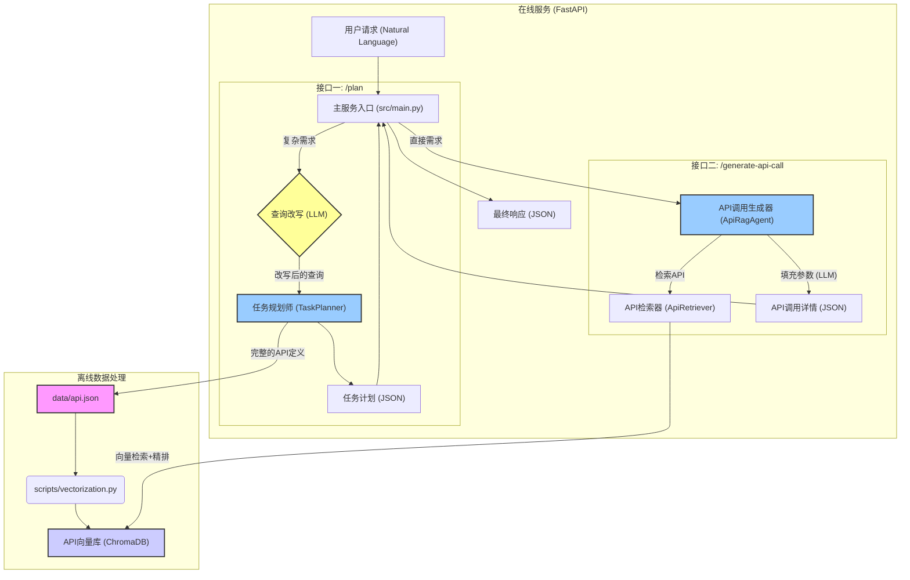

```mermaid
graph TD
    subgraph "离线数据处理"
        direction TB
        A1["data/api.json"] --> SCRIPT("scripts/vectorization.py");
        SCRIPT --> VS_API["API向量库 (ChromaDB)"];
    end

    subgraph "在线服务 (FastAPI)"
        direction TB
        USER["用户请求 (Natural Language)"] --> MAIN["主服务入口 (src/main.py)"];
        
        subgraph "接口一: /plan"
            direction TB
            MAIN -- "复杂需求" --> REWRITER{"查询改写 (LLM)"};
            REWRITER -- "改写后的查询" --> PLANNER["任务规划师 (TaskPlanner)"];
            PLANNER -- "完整的API定义" --> A1;
            PLANNER --> PLAN_JSON["任务计划 (JSON)"];
        end

        subgraph "接口二: /generate-api-call"
            direction TB
            MAIN -- "直接需求" --> AGENT["API调用生成器 (ApiRagAgent)"];
            AGENT -- "检索API" --> RETRIEVER["API检索器 (ApiRetriever)"];
            RETRIEVER -- "向量检索+精排" --> VS_API;
            AGENT -- "填充参数 (LLM)" --> CALL_JSON["API调用详情 (JSON)"];
        end

        PLAN_JSON --> MAIN;
        CALL_JSON --> MAIN;
        MAIN --> RESPONSE["最终响应 (JSON)"];
    end

    style A1 fill:#f9f,stroke:#333,stroke-width:2px
    style VS_API fill:#ccf,stroke:#333,stroke-width:2px
    style REWRITER fill:#ff9,stroke:#333,stroke-width:2px
    style PLANNER fill:#9cf,stroke:#333,stroke-width:2px
    style AGENT fill:#9cf,stroke:#333,stroke-width:2px
```