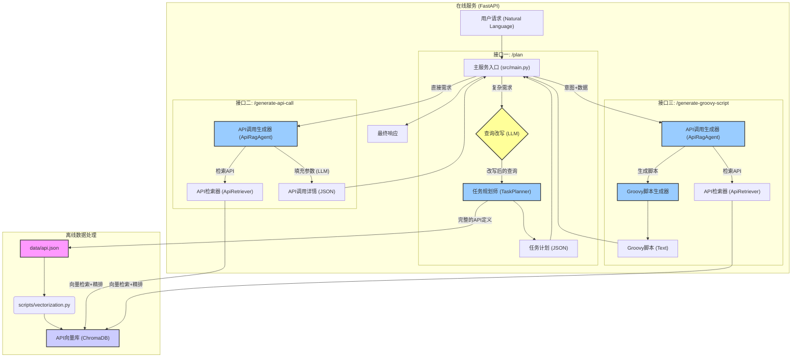

# 智能API规划与调用系统 - 设计文档

## 1. 系统架构总览

本系统采用基于FastAPI的单体应用架构，其内部逻辑高度模块化，遵循清晰的分层设计。核心设计思想是“意图理解”与“指令执行”的分离，通过引入大语言模型（LLM）作为推理核心，实现了从自然语言到结构化API调用的高效转换。

### 1.1. 架构图

### 1.2. 核心组件职责

- **数据层 (`data/`, `scripts/`)**: 
  - `data/api.json`: 系统的唯一事实来源，定义了所有可用API的完整规格。
  - `scripts/vectorization.py`: 离线脚本，负责将`api.json`中的信息向量化，构建用于语义检索的ChromaDB向量数据库。

- **服务层 (`src/main.py`)**: 
  - 作为FastAPI的服务入口，对外提供三大核心接口。
  - 负责请求的接收、解析、以及对下游核心逻辑的协调与调用。
  - 集成了“查询改写”的预处理逻辑，优化任务规划的输入。
  - 负责全局的日志初始化和异常处理。

- **规划与生成层 (`src/planning/`, `src/agent/`, `src/utils/`)**:
  - `TaskPlanner`: 接收清晰的用户指令，通过分析API间的数据流依赖，制定宏观的多步任务计划。
  - `ApiRagAgent`: 负责处理单个API的调用生成，是`/generate-api-call`和`/generate-groovy-script`接口的核心驱动。
  - `ApiRetriever`: 采用“向量检索+Reranker精排”的两阶段流程，为`ApiRagAgent`提供精准的API文档检索能力。
  - `GroovyScriptGenerator`: 工具类，负责将API定义和已知数据，转换为格式化的Groovy脚本。
  - `LLMFactory`: LLM工厂类，统一管理和创建不同提供商（OpenAI, Dashscope）的大模型和嵌入模型实例。

## 2. 关键流程设计

### 2.1. 流程一：任务规划 (`/plan`)

1.  **查询改写**: 用户的原始请求首先被送入一个专用的LLM Chain，该Chain被Prompt指示，要将模糊的请求改写成一个包含清晰业务逻辑步骤的、明确的指令。
2.  **任务规划**: `TaskPlanner`接收改写后的指令。它将完整的`api.json`作为上下文，让LLM分析其中每个API的`params`（输入）和`response`（输出），从而推断出API之间的数据流依赖关系，最终构建出一个包含串/并行结构的任务计划。

### 2.2. 流程二：API调用生成 (`/generate-api-call`)

1.  **检索与精排**: 用户的自然语言需求，首先由`ApiRetriever`处理。它先通过向量数据库进行快速的语义召回（粗筛），获得一批候选API；然后，利用Reranker模型对候选API进行深度分析和重新排序（精筛），返回最匹配的一个API文档。
2.  **参数填充**: `ApiRagAgent`将用户需求和检索到的API文档，一同交给一个专用于参数提取的LLM Chain。该Chain负责从需求中抽取出参数值，并识别出哪些必需的参数仍然缺失。
3.  **结果组装**: `ApiRagAgent`将API的元数据、填充好的参数和缺失参数列表，组装成一个结构化的JSON对象返回。

### 2.3. 流程三：Groovy脚本生成 (`/generate-groovy-script`)

1.  **API识别**: 此流程复用流程二的第一步，通过`ApiRetriever`精准地找到用户意图对应的API定义。
2.  **数据映射**: `GroovyScriptGenerator`接收到API定义和用户在`known_data`中提供的参数。它会遍历API定义的必填参数列表，并与`known_data`进行匹配。
3.  **模板填充**: 该生成器使用一个预设的Groovy代码模板。它将API的方法、URL、以及匹配上的参数，填充到模板的对应位置。对于未能匹配上的必填参数，则将其名称记录在脚本的注释区域，以提示用户。
4.  **返回脚本**: 最终，一个完整的、参数化的Groovy脚本字符串被生成并返回。

## 3. 配置与环境

- **配置管理**: 使用`pydantic-settings`库进行配置管理。所有配置项在`config/settings.py`中定义，其值通过根目录下的`.env`文件加载。这种方式实现了代码与配置的分离，保证了安全性。
- **日志系统**: 使用`loguru`库。在服务启动时，会根据`settings.py`中的配置，自动初始化日志系统，将日志同时输出到控制台和可回滚的日志文件中。
